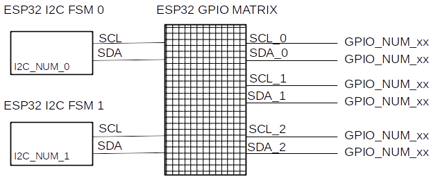
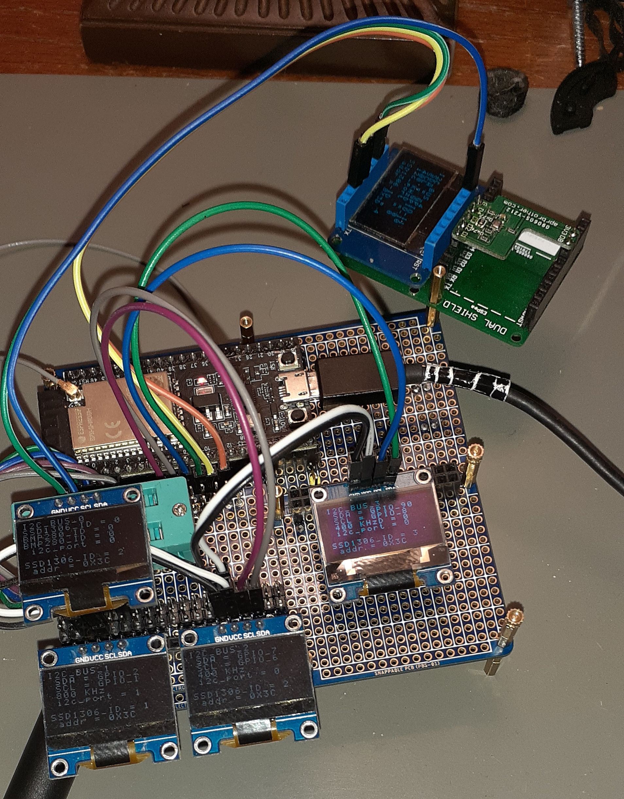

## ESP32 I2C task-safe interface & demo - _sys\_i2c_
> file: README.md
> author: burtrum
>
> https://github.com/Burtrum/esp32_sys_i2c_tasksafe_unlimited


### Overview - sys_i2c

The __sys\_i2c__ ESP32 _I2C Bus_ API supports an __unlimited__  number of __task-safe__ _I2C Bus_ interfaces. Each _I2C Bus_ is ESP32 HW driven; no SW bit-banging. The number of _I2C Buses_ is constrained only by available GPIO.

Provides I2C init\_all, read, write, probe, and scan\_print functions with table-driven initial configuration, including a simple _board support package_ for GPIO assignment.

Standard _I2C Controller_ mode with 7-bit address; _I2C Peripheral_ mode not supported.

Based on _C_, _ESP32-IDF_, _freeRTOS_, CMake and _Kconfig_.

#### How to use the sys_i2c API:

1. Define global board support package id to select GPIO mapping in board support table. FLASH.
1. Modify one board support table to define GPIOs. FLASH.
1. Modify one application configuration table to define number of _I2C Buses_, Clock Speed, and Clock Source flags. FLASH.
1. Execute _one-call_ table-driven initialization code. No init code changes, no matter how many _I2C Buses_.
1. Then read and write a lot of _I2C Buses_.

### Features - sys_i2c

- __freeRTOS__ __task-safe__.

- __Unlimited__ __I2C Buses__. No SW bit-banging.

- __Selectable Clock__. Choose between one or two _clk\_speeds_ per _I2C Bus_. New I2C  _clk\_flags_ feature aware; enabled automatically if the ESP32-IDF version is >= 4.3.

- __Board Support Package__. Simple GPIO assignment for all _I2C Buses_. For one-call initialization.

- __System Configuration Table__ easy to edit configuration tables define all _I2C Buses_. For one-call initialization.

- __One-Call Initialization__ reads configuration tables to init all _I2C Buses_. No init code changes regardless of number of _I2C Buses_.

- __Provides I2C operations__ _init\_all_, read, write, probe, and scan\_print.

- __I2C Controller__ mode with 7-bit address; _I2C Peripheral_ mode not supported.

- __C, ESP32-IDF, freeRTOS, CMake and Kconfig__.


### WOW! Three or more physical I2C Buses
Each ESP32 __I2C\_PERIPHERAL__ is a Finite State Machine (_I2C FSM_) that is programmed with `i2c_cmd_link_create() ...` and executed with `i2c_master_cmd_begin()`. (For ESP32-IDF >= 4.3 other calls exist. Not covered here, doesn't change the following description.)

Each _I2C FSM_ is essentially a smart clocked _data_ shift register that connects a _SCL_ clock and a _SDA_ data signal to the  internal ESP32 __GPIO\_MATRIX\_PERIPHERAL__ (_MATRIX_).

The _MATRIX_ is used as a _SCL/SDA_ dual-pin multiplexer for dynamic I2C pin re-assignment switching each _I2C FSM_ to multiple _I2C Bus_ external _GPIO_ pads.




__Figure 1__: I2C FSM MATRIX Multiplexer

Each _I2C FSM_ is used for its parts.

- The clock part is the internal _SCL_ clock source for any _I2C BUS_.
- The shift register part is the internal _SDA_ clocked I/O for any _I2C BUS_.

Each _I2C FSM_ is shared/switched in a task-safe way.

- Each _active_ _I2C FSM_ has a _freeRTOS_ _mutex_ lock. The _freeRTOS_ identifies the lock in _SemaphoreHandle_t_ from _xSemaphoreCreateMutex()_.


Now the ESP32 has unlimited task-safe _I2C Buses_.

#### Use one or two _I2C_FSM_

- One _I2C FSM_ port is required for unlimited _I2C Buses_ that have identical _clk\_speed_ with _clk\_flags_.
- Two _I2C FSM_ ports allow for two selectable _clk\_speed_ with _clk\_flags_.

> Two _I2C FSM_ ports _could_ allow for simultaneous unlimited _I2C Controllers_ and one _I2C Peripheral_. Not implemented nor planned.


#### Testing and SOC support

Currently tested on __ESP32__ and __ESP32-S2__ with five (5) _I2C Buses_. Five (5) SSD1306 displays, one per bus and one Bosch BMP280 Temperature/Pressure sensor on a shared bus. Exercised by a few _freeRTOS_ tasks competeting for the same _I2C Buses_.



__Photo 1__: 5 I2C Bus test with an ESP32-S2 Saola board.

Expected to work on the ESP32-S3. The ESP32-C3 RISC-V with minor changes.

The __ESP32__, __ESP32-S2__, and __ESP32-S3__ have two _I2C FSM_ ports.

The __ESP32-C3__ RISC-V has one _I2C FSM_ port.


## The _sys\_i2c_ API

This _sys\_i2c_ API identifies each:
- _I2C Bus_ with a `uint8_t sys_i2c_id = SYS_I2C_ID_xx` from `enum SYS_I2C_ID`.
- _Target Board_ with a `uint8_t bsp_id = BSP_xxxx` from `enum BSP_ID`.

The ESP32-IDF identifies each:
- _I2C FSM_ port as `i2c_port_t I2C_NUM_0` and `I2C_NUM_1`. Or just `I2C_NUM_0`.
- _GPIO_ pad as `gpio_num_t GPIO_NUM_19` or some other `GPIO_NUM_x`.


#### Step 1: Setup Flash Tables

1. Hard-code global board support package id `bsd_id` from `enum BSP_ID` in `app_config.h` , mainly for GPIO assignment. Think of it as naming the board to  the code. You will eventually create a new board. Until then just edit the `BSP_0000_DEFAULT` BSP table entry. More details below.

- `app_main.c:` APP_config = { .bsp_id = BSP_0000_DEFAULT, };

> __OR__
> Special case: Assignment of GPIO via _Kconfig_ `idf.py menuconfig`
>  (the demo uses this so you can set I2C GPIO manually)
>
> - `app_main.c:` APP_config = { .bsp_id = BSP_0000_KCONFIG, };


2. Modify application configuration tables to define number of _I2C Buses_, GPIOs, Clock.

- `app_config.h:` `enum SYS_I2C_ID` table for _sys_i2c_id_ name and number of _I2C Buses_; `SYS_I2C_ID_00` ...

- `app_config.c:` `SYS_I2C_config.unit[sys_i2c_id]` _C-struct_ table for ESP32\_IDF arguments.

- `bsp_config.c:` `BSP_I2C_config[bsp_id].unit[sys_i2c_id]` _C-struct_ table for GPIO assignment.


#### Step 2: Runtime Initialization and Operation
Now all the config tables are ready.

1. Execute _one-call_ table-driven initialization. No code changes, no matter how many _I2C Buses_.

```c
sys_i2c_init_all()
```

2. Then read and write a lot of _I2C Buses_.

```c
sys_i2c_read(sys_i2c_id, ..)  or sys_i2c_read(SYS_I2C_ID_00, ..)
sys_i2c_write(sys_i2c_id, ..) or sys_i2c_write(SYS_I2C_ID_03, ..)
```

## The _sys\_i2c_ API at a glance.

```c
// ESP32 SYS_I2C API summary.
// All return-codes are `bool true false`. Meaning simple pass/fail.

// The application configuration `app_config.h` includes all `sys_*` compatible APIs.
// Specifically `sys_i2c.h` is included automatically.
#include "app_config.h"

// Application System naming of board GPIO configuration, bsp_id.
// Defined in app_config.h
enum BSP_ID {
    BSP_0000_DEFAULT, // 0: this one entry is required
    BSP_0000_KCONFIG, // GPIO values from menuconfig/Kconfig not BSP table
    BSP_0001_ESP32S2_SAOLA_1,
    // ...
    BSP_ID_CNT // DO NOT RENAME, always last, automatically adjusts.
};

// Application System naming of I2C Buses
// Defined in app_config.h
enum SYS_I2C_ID {
    SYS_I2C_ID_00, // I2C_BUS #1, required.
    SYS_I2C_ID_01, // I2C_BUS #2
    // ...
    SYS_I2C_ID_CNT // DO NOT RENAME, always last, automatically adjusts.
};

// FLASH Input tables to sys_i2c_init_all()
// Read only once during init.
// Set in bsp_config.c
// Set in app_config.c
const struct BSP_I2C_CONFIG     BSP_I2C_config[BSP_ID_CNT];
const struct SYS_I2C_CONFIG     SYS_I2C_config;

// RAM Output table from sys_i2c_init_all()
// No writes after init. Validated values read during operation.
struct SYS_I2C_RUNTIME      SYS_I2C_runtime; // internal, all values validated

bool sys_i2c_init_all(void);
bool sys_i2c_read(uint8_t  sys_i2c_id, uint8_t i2c_addr_num, uint8_t i2c_reg_num, uint8_t * buf_addr, size_t buf_size);
bool sys_i2c_write(uint8_t sys_i2c_id, uint8_t i2c_addr_num, uint8_t i2c_reg_num, uint8_t * buf_addr, size_t buf_size);
bool sys_i2c_probe(uint8_t sys_i2c_id, uint8_t i2c_addr_num, bool * found_flag_addr);
bool sys_i2c_scan_print(void);

uint8_t sys_i2c_id   = SYS_I2C_ID_03; // 4th I2C Bus; index into RAM runtime table.
uint8_t i2c_addr_num = 0x3C;    // The I2C device address number on the bus.
uint8_t i2c_reg_num  = 0x00;    // That I2C device's internal register number.
size_t  buf_size     = 42;
uint8_t buf_addr[42];
bool    found_flag   = false;

if (!sys_i2c_init_all()) { goto fail; }
if (!sys_i2c_scan_print() { goto fail; }

if (!sys_i2c_read(sys_i2c_id, i2c_addr_num, i2c_reg_num, buf_addr, buf_size)) { goto fail; }

if (!sys_i2c_write(sys_i2c_id, i2c_addr_num, i2c_reg_num, buf_addr, buf_size)) { goto fail; }

if (!sys_i2c_probe(sys_i2c_id, i2c_addr_num, &found_flag)) { goto fail; }
if (found_flag) { printf("I2C PROBE FOUND: sys_i2c_id = %d, i2c_addr_num = %.2x\n", sys_i2c_id, i2c_addr_num); }

```

## The sys_i2c DEMO
For the demo, only one _task-safe_ I2C Bus is defined, `SYS_I2C_ID_00`.

This demo probes, scans and prints a classic I2C map for each and all _I2C Buses_. No external I2C devices are needed to compile and run the demo.

> The _I2C Bus_ is `sys_i2c_id = SYS_I2C_ID_00`.
>
> The _Board_ is `bsp_id = BSP_0000_KCONFIG`.


For ease of your first compile and run, the demo runs with one _I2C Bus_ whose GPIO pins are set with `idf.py menuconfig`. This is a special demo case with the board support id, `bsp_id = BSP_0000_KCONFIG`.

The demo can be run after setting just 2 GPIOs with Kconfig to match your hardware's single I2C Bus.
The demo has internal pull-ups enabled by default, therefore a set of I2C pins with no I2C devices (no resistors) still will run and just report no I2C devices found. External pull-up resistors are always required for correct operation.


## How to configure the demo

For the demo, the board is `bsp_id = BSP_000_KCONFIG`, that expects the GPIOs SCL and SDA to be entered via Kconfig `idf.py menuconfig`.

Current default: GPIO pins SCL = 3, SDA = 4. The clk_speed = 400Khz, if enabled, clk_flags = 0.

##### The default I2C GPIO
This is only for one I2C Bus `SYS_I2C_ID_00` and board support id `BSP_0000_KCONFIG`.
I2C SCL and SDA GPIO definitions are set with `idf.py menuconfig`, aka _set with Kconfig_.

> As explained below, during normal sys_i2c API operation, the GPIO is defined in a easy to modify `c-struct` table, `BSP_I2C_config`. But for this demo I wanted `Kconfig`assignment to the one single I2C Bus defined. This is absolutely opposite to the whole _table driven_ init scheme that make configuration easy.
Easy means limiting manual interaction and errors, separation of GPIO definitions from application code, and making switching an application to a new board easy to automatize.

#### Kconfig Setup

```
    idf.py menuconfig

    Component config  --->
    SYS_I2C Demo Configuration  --->
        (3) SCL GPIO number for I2C Bus: SYS_I2C_ID_00
        (4) SDA GPIO number for I2C Bus: SYS_I2C_ID_00
        [*] Enable internal pull-up resistors
```

1. Set I2C Bus SCL and SDA GPIO number.
2. Enable/Disable internal resistors, default _true_.

Internal resistors allow for scope or logic analyzer observation on a bus with no I2C devices or external pull-ups. Use _false_ for normal operation with external pull-up resistors.


##### Internal details: Set the demo I2C Bus GPIO from `Kconfig` .

These `#define`s _catch_ the Kconfig GPIO values into the code in just one spot, `app_config.h`.

> Key Concept: Isolate Kconfig settings from application code.
>
> Only `SYS_I2C_ID_00_SCL_IO_NUM` is used internally, not `CONFIG_SYS_I2C_ID_00_SCL_IO_NUM`. And the same for SDA of course.

```
// app_config.h, in the sys_i2c section
#define SYS_I2C_ID_00_SCL_IO_NUM    CONFIG_SYS_I2C_ID_00_SCL_IO_NUM
#define SYS_I2C_ID_00_SDA_IO_NUM    CONFIG_SYS_I2C_ID_00_SDA_IO_NUM
```

A board `bsp_id = BSP_0000_KCONFIG` requires these Kconfig GPIO values be pre-processor loaded into the `BSP_I2C_config[BSP_0000_KCONFIG]` FLASH table.
This demo case also only requires one I2C Bus `SYS_I2C_ID_00`therefore a BSP table with only one _I2C Bus_ `.unit[sys_i2c_id]` entry is shown. The second board entry `BSP_0000_DEFAULT` illustrates _normal_ setup with GPIO hard-coded as `GPIO_NUM_xx` and not assigned by Kconfig.

```
// Abstracted from bsp_config.c; struct BSP_I2C_CONFIG defined in sys_i2c.h
const struct BSP_I2C_CONFIG
BSP_I2C_config[BSP_ID_CNT] = {
    [BSP_0000_KCONFIG] = {
        .unit = {
            [SYS_I2C_ID_00] = {
                .scl_io_num = SYS_I2C_ID_00_SCL_IO_NUM,
                .sda_io_num = SYS_I2C_ID_00_SDA_IO_NUM,
            },
        },
    },

    [BSP_0000_DEFAULT] = {
        .unit = {
            [SYS_I2C_ID_00] = {
                .scl_io_num = GPIO_NUM_3,
                .sda_io_num = GPIO_NUM_4,
            },
        },
    },
};

```


### Build Notes

This is the __sys\_i2c__ API bundled with some `app_main.c` example demo code. The `sys_i2c` API is just what is in the local `components` folder plus all `config` files in the `main` folder along side `app_main.c`.

> File organization is not finalized. I was hoping for a config directory, with BSP aside from other APP config files. This is a work in progress.

To build your application in this  `main`
- Replace example code `app_main()` with your application code `app_main()`.
- Modify both `app_config.h` `app_config.c`files per application requirements.
- Modify `bsp_config.c` file per application requirements.

To add this API to your application build:
- Copy `components/include` and `components/sys_i2c`
- Copy `main/app_config.h` `main/app_config.c`and `main/bsp_config.c`
- Modify both `app_config.h` `app_config.c`files per application requirements.
- Modify `bsp_config.c` file per application requirements.
- Edit your `CMakeLists.txt` as needed.


```
esp32_sys_i2c_tasksafe_unlimited
├── CMakeLists.txt
├── components
│   ├── include
│   │   ├── sys_i2c.h
│   │   └── sys_trace_macros.h
│   └── sys_i2c
│       ├── CMakeLists.txt
│       └── sys_i2c.c
├── docs
├── main
│   ├── app_config.c
│   ├── app_config.h
│   ├── app_main.c
│   ├── bsp_config.c
│   └── CMakeLists.txt
├── README.md
└── sdkconfig
```


#### Moving the application to another board.

The `BSP` scheme is a simple  `C-structure` table verses a higher level JSON, XML, KConfig and other more complicated methods. The `bsp_id` is the table index.

To move this working application to a __pre-defined board__:
- Change the _board support package id_, the `bsp_id` in `app_main.c`.
- No changes needed any application code. Really.

To create and use a __pre-defined board__
- Modify `enum BSP_ID` to add a board id, `bsp_id`.
- Modify ONLY `bsp_config.c` file per application requirements.
- Change the _board support package id_, the `bsp_id` in `app_main.c`.


#### CMake Notes

In `CMakeLists.txt`:

May need `REQUIRES sys_i2c` component TAG, if  you get `sys_i2c.h` not found, or something close.

Use REQUIRED_IDF_TARGETS checks for ESP32 family. Add `esp32s3` - never tested.
```
idf_component_register(
    REQUIRES
        app_trace
        sys_i2c

    REQUIRED_IDF_TARGETS
        esp32
        esp32s2
)
```

## YOU COULD RUN THE DEMO, the rest is just ...

### The Details.

Offering unlimited _I2C Buses_ requires managing GPIO pin multiplexing on each _I2C Bus_ access. And on boot initialization, multiple _I2C Buses_ must be assigned to their physical _SCL/SDA_ GPIO pins. Add in a simple _board support package_ for GPIO definitions. Sounds like a job for look-up tables synchronized with a common table index.

> A core architectural concept are the _user defined, application specific_ FLASH and RAM tables, with a common table index. The _valid_  index values or _ids_ are a set of user defined _C-enumerated IDs_.

In this __sys\_i2c__ API the _I2C Bus_ number, `sys_i2c_id` is the common table index.

#### Identity - it's all about the _id_

The `enum SYS_I2C_ID` value in `uint8_t sys_i2c_id` completely identifies an _I2C Bus_ to every level of code.

- to higher-level user application code.
- to I2C device drivers such as `dev_ssd1306` or `dev_bmp280` drivers.
- to lower-level ESP32\_IDF\_ I2C drivers.
- is the table-lookup index to the assigned set of SCL/SDA GPIO pins and clock speed.

By convention:
- a variable `uint8_t sys_i2c_id` is used to hold the __enum SYS\_I2C\_ID__ value.
- Valid values are: __SYS\_I2C\_ID\_00__, __SYS\_I2C\_ID\_01__, __SYS\_I2C\_ID\_02 ...__

By design:
- The number of _I2C Buses_ is __SYS\_I2C\_ID\_CNT__.
- The `sys_i2c_id` is _aways valid_ from __0__ to __SYS\_I2C\_ID\_CNT__ - _1_.

Conceptually, the `sys_i2c_id` replaces the ESP32\_IDF `i2c_port_num` in all `sys_i2c` API operations.

#### Operation

These user application _I2C Bus_ operations are available after initialization with `sys_i2c_init_all()`.

A single `#include app_config.h` is required in application code. This automatically includes `sys_i2c.h`.

```c
// After config tables filled out and after calling sys_i2c_init_all()
#include "app_config.h"

uint8_t sys_i2c_id   = SYS_I2C_ID_03; // 4th I2C Bus; index into RAM runtime table.
uint8_t i2c_addr_num = 0x3C;    // The I2C device address number on the bus.
uint8_t i2c_reg_num  = 0x00;    // That I2C device's internal register number.
size_t  buf_size     = 42;
uint8_t buf_addr[42];
bool    found_flag   = false;

if (!sys_i2c_read(sys_i2c_id, i2c_addr_num, i2c_reg_num, buf_addr, buf_size)) { goto fail; }

if (!sys_i2c_write(sys_i2c_id, i2c_addr_num, i2c_reg_num, buf_addr, buf_size)) { goto fail; }

if (!sys_i2c_probe(sys_i2c_id, i2c_addr_num, &found_flag)) { goto fail; }
if (found_flag) { printf("I2C PROBE FOUND: sys_i2c_id = %d, i2c_addr_num = %.2x\n", sys_i2c_id, i2c_addr_num); }

if (!sys_i2c_scan_print() { goto fail; }
```


#### Initialization

##### BSP board identification

The BSP `bsp_id` is not defined within the scope of the `sys_i2c` tables.
The board selection is at the __APP__ application level. Defined in __app\_config.h__.  Set and checked in __app\_main.c__.
The global FLASH structure `APP_config` holds the `bsp_id`. A `bsp_id` value of __0__ is always valid.

```c
// Application System naming of board GPIO configuration, bsp_id.
// Defined in app_config.h
enum BSP_ID {
    BSP_0000_DEFAULT, // 0: this one entry is required
    BSP_0000_KCONFIG, // GPIO values from menuconfig/Kconfig not BSP table
    BSP_0001_ESP32S2_SAOLA_1,
    // ...
    BSP_ID_CNT // DO NOT RENAME, always last, automatically adjusts.
};

struct APP_CONFIG {
    uint8_t bsp_id; // enum BSP_ID index into BSP_I2C_config[bsp_id]
};

// In app_main.c
#include "app_config.h"
const struct APP_CONFIG
APP_config = {
    .bsp_id = BSP_0000_DEFAULT,
};

void app_main(void)
{
    // First thing, check the BSP_ID is in range: 0 to BSP_ID_CNT-1
    // it's uint8_t bsp_id, so '>' works.
    assert(BSP_ID_CNT > APP_config.bsp_id);

    // code ...
}
```

__I2C Bus configuration__

The _I2C Bus_ configuration tables are the only _input-data_ into the _one-call_ initialization code. The init code never has to be modified, only the config tables need to be edited. This _SYS\_I2C_ API architecture treats initialization as an __initial state__ problem, separating _steps_ and _data_.

> Oddly, it seems to me that most APIs are designed to helpfully hide details on operations like read and write from you, but joyfully make you read a 200 page TRM so that we each can write our own guess of an initialization algorithm.
> My opinion is that traditional API mostly ignore initialization. Meaning they could make it easier. You read lots of manuals and write your own magic init code, handle errors, print, debug...
>
> So another core architectural concept is that there is only one initialization routine to call regardless of the number of things to init. The init routine should never need editing once correct.

In this __sys\_i2c API__ `sys_i2c_init_all()` is the table driven init routine. Notice that it takes no arguments.

__Initialize all I2C Buses__

Fill in the config tables before calling init.
All compile-time config data is in `app_config.h`, `app_config.c`, and for GPIO pins, `bsp_config.c`.

A return of `false` on init requires a decision to give up and reset OR fail gracefully, skipping I2C functionality and moving on to something else such as _wifi\_init_ to report back status.

```c
#include "app_config.h"

if (!sys_i2c_init_all()) { goto fail; }  // Read FLASH tables. Init all I2C Buses
```

Config tables shown here for some extra clarity, not needed to be declared in user code.
```c
// Also enum SYS_I2C_ID in app_conf.h
extern const struct APP_CONFIG      APP_config;     // for bsp_id; in app_config.c
extern const struct BSP_I2C_CONFIG  BSP_I2C_config[BSP_ID_CNT]; // in bsp_config.c
extern const struct SYS_I2C_CONFIG  SYS_I2C_config;             // in app_config.c
```

__I2C Bus initialization data__ is stored in two (2) configuration tables. Both configuration tables are compile-time _C-structures_ stored in FLASH memory and read only during initialization. The system configuration table `SYS_I2C_config` makes adding and initializing any number of _I2C Buses_ simple. And the board support package table `BSP_I2C_config` easily selects from multiple pre-defined GPIO mappings by changing just one setting, the __bsp\_id__ table index.

__I2C Bus pin multiplexing data__ is in one (1) runtime RAM table `SYS_I2C_runtime`created from the two (2) FLASH config tables -- combining application (SYS) and board (BSP) definitions into one central table. The `SYS_I2C_runtime` table holds ESP32 `i2c_port_num`, `scl_io_num`, `sda_io_num` and `clk_speed`, `clk_flags` for each  `sys_i2c_id` _I2C Bus_. Each _I2C_FSM_ also has a `mutex lock`.

__I2C Bus identification__: Each _I2C Bus_ is completely identified by a unique _C-enumurated_ table index, `sys_i2c_id`. Defined in `enum SYS_I2C_ID` every level of code uses this single `sys_i2c_id` to access each physical _I2C Bus_. These `sys_i2c_id` I2C Bus names are are pre-defined, but arbitrary. The `sys_i2c_id` value __aways__ has a valid verifiable range of: 0 to __SYS\_I2C\_ID\_CNT__ - _1_.

> I really like `C-enumeration` for constants, but as variable declarations they are too _implementation dependant_ for me. They can be _signed_ or _unsigned_. So I put _enum values_ from `enum SYS_I2C_ID`into `uint8_t sys_i2c_id;` NOT into `enum SYS_I2C_ID sys_i2c_id;`


### Modifying the _I2C Bus_ configuration tables.

1. `enum SYS_I2C_ID` defines the _I2C Bus_ IDs, or names in `app_config.h`.

1. `SYS_I2C_config` holds ESP32 IDF data for I2C init in `app_config.c` and `sys_i2c.h`.

1. `BSP_I2C_config[BSP_ID_CNT]` holds GPIO SCL and SDA pin mapping in `bsp_config.c` and `sys_i2c.h`.

Step 1: Fill in `sys_i2c_id` valid values -- name the _I2C Buses_.
Leave `SYS_I2C_ID_CNT`.

```c
// app_config.h, includes sys_i2c.h
// index into SYS_I2C_runtime, SYS_I2C_config, BSP_I2C_config[bsp_id] tables
enum SYS_I2C_ID {
    SYS_I2C_ID_00, // I2C_BUS #1, required, has a value of 0
    SYS_I2C_ID_01, // I2C_BUS #2
    SYS_I2C_ID_02, // I2C_BUS #3
    SYS_I2C_ID_03, // I2C_BUS #4
    SYS_I2C_ID_04, // I2C_BUS #5 has a value of (SYS_I2C_ID_CNT - 1)
    SYS_I2C_ID_CNT // DO NOT RENAME, always last, automatically adjusts.
};
```
Step 2: Fill in the `SYS_I2C_config` table.

Each _I2C Bus_ selects it's clock source in `.unit[sys_i2c_id].port_num`

Each ESP32 _I2C FSM_ clock speed set in `.port[port_num].clk_speed`

Each ESP32 _I2C FSM_ clock flags set in `.port[port_num].clk_flags`
> If all _I2C Buses_ have the same speed&flags, only one ESP32 _I2C FSM_ (I2C_NUM_0 or I2C_NUM_1) is required. But currently all _I2C FSM_ must be defined.

```c
const struct SYS_I2C_CONFIG
SYS_I2C_config = {
    .unit = {
        [SYS_I2C_ID_00] = { .port_num = I2C_NUM_0, },
        [SYS_I2C_ID_01] = { .port_num = I2C_NUM_0, },
        [SYS_I2C_ID_02] = { .port_num = I2C_NUM_0, },
        [SYS_I2C_ID_03] = { .port_num = I2C_NUM_0, },
        [SYS_I2C_ID_04] = { .port_num = I2C_NUM_1, }, // Example Use I2C_NUM_1 to select clock 100000U
    },

   .port = {
        [I2C_NUM_0] = {
            .clk_speed = 400000U, // 400 KHz
            .clk_flags = 0, // untested, safe default.
        },

        [I2C_NUM_1] = {
            .clk_speed = 100000U, // 100 KHz
            .clk_flags = 0, // I2C_SCLK_SRC_FLAG_FOR_NOMAL
        },
    },
}; // end: SYS_I2C_config
```

Step 3: Fill in the `BSP_I2C_config` table.

The _BSP_ table currently just holds GPIO assignments. One complete set for each board. These assignments are application specific, that is each application carries it's own validated _BSP_ assignments. (LAZY alert: for this doc, some the GPIO numbers are the same, not normally true)

> Key Concept
>> Once an application is working, __ONLY__ BSP edits are required to run on another system. Add an entry in BSP_I2C_config and a matching entry in enum BSP_ID.

```c
const struct BSP_I2C_CONFIG
BSP_I2C_config[BSP_ID_CNT] = {
    [BSP_0000_KCONFIG] = {
        .unit = {
            [SYS_I2C_ID_00] = { .sda_io_num = SYS_I2C_ID_00_SDA_IO_NUM,  .scl_io_num = SYS_I2C_ID_00_SCL_IO_NUM, },
            [SYS_I2C_ID_01] = { .sda_io_num = SYS_I2C_ID_01_SDA_IO_NUM,  .scl_io_num = SYS_I2C_ID_01_SCL_IO_NUM, },
            [SYS_I2C_ID_02] = { .sda_io_num = SYS_I2C_ID_02_SDA_IO_NUM,  .scl_io_num = SYS_I2C_ID_02_SCL_IO_NUM, },
            [SYS_I2C_ID_03] = { .sda_io_num = SYS_I2C_ID_03_SDA_IO_NUM,  .scl_io_num = SYS_I2C_ID_03_SCL_IO_NUM, },
            [SYS_I2C_ID_04] = { .sda_io_num = SYS_I2C_ID_04_SDA_IO_NUM, .scl_io_num = SYS_I2C_ID_04_SCL_IO_NUM, },
        },
    },

    [BSP_0000_DEFAULT] = {
        .unit = {
            [SYS_I2C_ID_00] = { .sda_io_num = GPIO_NUM_4,  .scl_io_num = GPIO_NUM_3, },
            [SYS_I2C_ID_01] = { .sda_io_num = GPIO_NUM_2,  .scl_io_num = GPIO_NUM_1, },
            [SYS_I2C_ID_02] = { .sda_io_num = GPIO_NUM_7,  .scl_io_num = GPIO_NUM_6, },
            [SYS_I2C_ID_03] = { .sda_io_num = GPIO_NUM_9,  .scl_io_num = GPIO_NUM_8, },
            [SYS_I2C_ID_04] = { .sda_io_num = GPIO_NUM_11, .scl_io_num = GPIO_NUM_10, },
        },
    },
    // Add more BSP definitions, adjust `enum BSP_ID` in `app_config.h`
};
```

Step 4: Initialize all _I2C Buses_.

After the I2C config tables are specified, one call to `sys_i2c_init_all()` initializes all of the _I2C Buses_, regardless of their total number.

```c
if (!sys_i2c_init_all()) { goto fail; }  // Read FLASH tables. Init all I2C Buses
```

Now all _I2C Buses_ are ready to be used.

> Key concept
>> is that _table-driven_ initialization code never needs to be modified if the number of initialized objects changes. Separation of the config data and the initialization algorithm.

These tables are a critical difference compared with traditional API.  Traditional API still ignore initialization.  This API architecture treats initialization as an 'initial state' problem. Fill tables to set initial state of each 'object' and then call one initialization routine.

> Key concept
>> is the init data from the FLASH config tables are __validated__ and then copied to the RAM runtime table. This validation means all internal routines do not have to recheck. Separation of _as-entered_ and _validated_ data.

Step 5: Use the `sys_i2c_id` to read and write the _I2C Bus_ of choice.

```c
uint8_t sys_i2c_id;
sys_i2c_id = SYS_I2C_ID_00; // first I2C Bus = 0

if (!sys_i2c_read(sys_i2c_id, i2c_addr_num, i2c_reg_num, buf_addr, buf_size)) { goto fail; }

if (!sys_i2c_write(SYS_I2C_ID_03, i2c_addr_num, i2c_reg_num, buf_addr, buf_size)) { goto fail; }
```
- A device on an I2C bus, such as a SSD1306 OLED display will use an user assigned *sys_i2c_id* in it's own configuration table to associatie itself to a specific I2C bus. The `sys_i2c` API is not aware of connected devices.


## Scan and print all _I2C Buses_.
If you have my five (5) _I2C Bus_ setup.

I2C Device           | Quantity | I2C Address | GPIO SDA/SCL |
---------------------|----------|-------------|-------------|
SSD1306 OLED DISPLAY |  4       | 0x3C        | 4/3, 2/1, 7/6, 9/8 |
SSD1306 OLED DISPLAY |  1       | 0x3D        | 11/10 shared      |
BMP280 T/P Sensor    |  1       | 0x77        | 11/10 shared      |

```c
if (!sys_i2c_scan_print()) { goto fail; }
```
## Expected Output
```c
START I2C SCAN
There are :: 5 :: I2C Buses [SYS_I2C_ID_CNT]

I2C Bus sys_i2c_id = 0
sda_io_num = 4, scl_io_num = 3
i2c_port_num = 0: clk_speed = 400000, clk_flags = 0

     0  1  2  3  4  5  6  7  8  9  a  b  c  d  e  f

00: -- -- -- -- -- -- -- -- -- -- -- -- -- -- -- --
10: -- -- -- -- -- -- -- -- -- -- -- -- -- -- -- --
20: -- -- -- -- -- -- -- -- -- -- -- -- -- -- -- --
30: -- -- -- -- -- -- -- -- -- -- -- -- 3c -- -- --
40: -- -- -- -- -- -- -- -- -- -- -- -- -- -- -- --
50: -- -- -- -- -- -- -- -- -- -- -- -- -- -- -- --
60: -- -- -- -- -- -- -- -- -- -- -- -- -- -- -- --
70: -- -- -- -- -- -- -- -- -- -- -- -- -- -- -- --

I2C Bus sys_i2c_id = 1
sda_io_num = 2, scl_io_num = 1
i2c_port_num = 1: clk_speed = 100000, clk_flags = 0
     0  1  2  3  4  5  6  7  8  9  a  b  c  d  e  f

00: -- -- -- -- -- -- -- -- -- -- -- -- -- -- -- --
10: -- -- -- -- -- -- -- -- -- -- -- -- -- -- -- --
20: -- -- -- -- -- -- -- -- -- -- -- -- -- -- -- --
30: -- -- -- -- -- -- -- -- -- -- -- -- 3c -- -- --
40: -- -- -- -- -- -- -- -- -- -- -- -- -- -- -- --
50: -- -- -- -- -- -- -- -- -- -- -- -- -- -- -- --
60: -- -- -- -- -- -- -- -- -- -- -- -- -- -- -- --
70: -- -- -- -- -- -- -- -- -- -- -- -- -- -- -- --

I2C Bus sys_i2c_id = 2
sda_io_num = 7, scl_io_num = 6
i2c_port_num = 0: clk_speed = 400000, clk_flags = 0
     0  1  2  3  4  5  6  7  8  9  a  b  c  d  e  f

00: -- -- -- -- -- -- -- -- -- -- -- -- -- -- -- --
10: -- -- -- -- -- -- -- -- -- -- -- -- -- -- -- --
20: -- -- -- -- -- -- -- -- -- -- -- -- -- -- -- --
30: -- -- -- -- -- -- -- -- -- -- -- -- 3c -- -- --
40: -- -- -- -- -- -- -- -- -- -- -- -- -- -- -- --
50: -- -- -- -- -- -- -- -- -- -- -- -- -- -- -- --
60: -- -- -- -- -- -- -- -- -- -- -- -- -- -- -- --
70: -- -- -- -- -- -- -- -- -- -- -- -- -- -- -- --

I2C Bus sys_i2c_id = 3
sda_io_num = 9, scl_io_num = 8
i2c_port_num = 0: clk_speed = 400000, clk_flags = 0
     0  1  2  3  4  5  6  7  8  9  a  b  c  d  e  f

00: -- -- -- -- -- -- -- -- -- -- -- -- -- -- -- --
10: -- -- -- -- -- -- -- -- -- -- -- -- -- -- -- --
20: -- -- -- -- -- -- -- -- -- -- -- -- -- -- -- --
30: -- -- -- -- -- -- -- -- -- -- -- -- 3c -- -- --
40: -- -- -- -- -- -- -- -- -- -- -- -- -- -- -- --
50: -- -- -- -- -- -- -- -- -- -- -- -- -- -- -- --
60: -- -- -- -- -- -- -- -- -- -- -- -- -- -- -- --
70: -- -- -- -- -- -- -- -- -- -- -- -- -- -- -- --

I2C Bus sys_i2c_id = 4
sda_io_num = 11, scl_io_num = 10
i2c_port_num = 0: clk_speed = 400000, clk_flags = 0
     0  1  2  3  4  5  6  7  8  9  a  b  c  d  e  f

00: -- -- -- -- -- -- -- -- -- -- -- -- -- -- -- --
10: -- -- -- -- -- -- -- -- -- -- -- -- -- -- -- --
20: -- -- -- -- -- -- -- -- -- -- -- -- -- -- -- --
30: -- -- -- -- -- -- -- -- -- -- -- -- -- 3d -- --
40: -- -- -- -- -- -- -- -- -- -- -- -- -- -- -- --
50: -- -- -- -- -- -- -- -- -- -- -- -- -- -- -- --
60: -- -- -- -- -- -- -- -- -- -- -- -- -- -- -- --
70: -- -- -- -- -- -- -- 77 -- -- -- -- -- -- -- --

END I2C SCAN: :: 6 :: devices on :: 5 :: I2C Buses
```

## __sys\_i2c__ summary

#### I2C 7-Bit I2C Addresses 0x00 - 0x7F
```
0x00 - Reserved - General Call Address
0x01 - Reserved for CBUS Compatibility
0x02 - Reserved for I2C-compatible Bus Variants
0x03 - Reserved for Future Use
0x04 0x05 0x06 0x07 - Reserved for HS-mode Master

0x08 - 0x77 Valid Device Address

0x78 0x79 0x7A 0x7B - Reserved for 10-bit I2C Addressing
0x7C 0x7D 0x7E 0x7F - Reserved for Future Purposes
```


#### How to read the FLASH Config Tables
Read only once and validated in `sys_i2c_init_all()`. Then copied to runtime table.

```c
// Requires bsp_id  set at compile-time in app_main.c.

extern const struct BSP_I2C_CONFIG  BSP_I2C_config[BSP_ID_CNT]; // in bsp_config.c
extern const struct SYS_I2C_CONFIG  SYS_I2C_config;         // in app_config.c

uint8_t     bsp_id;
uint8_t     sys_i2c_id;

gpio_num_t  sda_io_num;
gpio_num_t  scl_io_num;
i2c_port_t  port_num;
uint32_t    clk_speed;
uint32_t    clk_flags;

// Read APP_config for bsp_id; pre-validated in app_main.c
bsp_id = APP_config.bsp_id;

// Select an I2C Bus, validate value.
sys_i2c_id = SYS_I2C_ID_00; // in app_config.h
if (!(SYS_I2C_ID_CNT > sys_i2c_id)) { goto fail; }

// Read BSP_I2C_config[BSP_ID_CNT] for a single I2C BUS
sda_io_num  = BSP_I2C_config[bsp_id].unit[sys_i2c_id].sda_io_num;
scl_io_num  = BSP_I2C_config[bsp_id].unit[sys_i2c_id].scl_io_num;

// Read SYS_I2C_config for a single I2C BUS
port_num    = SYS_I2C_config.unit[sys_i2c_id].port_num;
clk_speed   = SYS_I2C_config.port[port_num].clk_speed;
clk_flags   = SYS_I2C_config.port[port_num].clk_flags; // WIP
```


#### How to read the internal RAM Runtime Table
This table combines _SYS_ and _BSP_ FLASH tables.
After init, during operation these __validated__ entries are used. No FLASH reads.
Notice one table, not three, and index is only `sys_i2c_id`. Not `bsp_id` or `port_num`.

> Key concept
>> All data in a runtime table is pre-validated, so no data read from the table needs further validation.

```c
// Read SYS_I2C_runtime
// Select an I2C Bus, validate value.
sys_i2c_id = SYS_I2C_ID_00; // in app_config.h
if (!(SYS_I2C_ID_CNT > sys_i2c_id)) { goto fail; }

sda_io_num = SYS_I2C_runtime.unit[sys_i2c_id].sda_io_num;
scl_io_num = SYS_I2C_runtime.unit[sys_i2c_id].scl_io_num;

port_num   = SYS_I2C_runtime.unit[sys_i2c_id].port_num;
clk_speed  = SYS_I2C_runtime.unit[sys_i2c_id].clk_speed;
clk_flags  = SYS_I2C_runtime.unit[sys_i2c_id].clk_flags;
```


### My embedded design guidelines
Don't forget this is really a freeRTOS system that supports the ESP32, not the other way around. Or is it?
I avoid _freeRTOS_ or ESP32 specifics as soon as possible. Remember this is embedded, not _Linux_ and error handling should be different.

#### Fail Gracefully
> A failed I2C Display should not prevent your WiFi zombie detector from alerting you.

ESP\_ERROR_CHECK is an `abort()` and will kill your application with no chance for recovery.

[Espressif Warning about ESP\_ERROR_CHECK ](https://docs.espressif.com/projects/esp-idf/en/latest/api-guides/error-handling.html)

> Many ESP-IDF examples use ESP_ERROR_CHECK to handle errors from various APIs.
> This is not the best practice for applications, and is done to make example code more concise.

Embedded desgn rules:

- Design-Time errors are the most critical to catch.
- Run-Time errors are passed _up_ and are handled at the highest level possible.
    - No _fatal error_ loop, abort or reset at lower levels.
- All functions _always_ have return code checked.
    - Use bool true/false _Return-Codes_ unless forced to do otherwise.
    - Use _void_ return sparingly.
    - Returned data should be indirect via pointer. (yes evil pointers)
    - Return-Codes are for program flow during _runtime_ and to catch all errors during _Design-Time_.
- All functions _always_ have argument ranged checked.
    - Having no function arguments is the safest.
    - Use validated lookup tables when possible.
- Use static memory. No alloc/free.
- Avoid typedefs. Just because.
- Avoid _void_ pointers. They are just insane, and cripple the compliers own type-checking.
- Use enum instead of multiple defines. The last element of an enum list is it's _SIZE_.

Don't spend a lot of effort processing _runtime_ errors for programmers. Minimize the translation of error codes to text. This really simplifies the code.
See my example code for TRACE\_ENTER, TRACE\_PASS, and TRACE\_FAIL macros.

### Architecture Key Concepts - ~~restated~~  ramblings

- A core architectural concept in my _APIs_ are user defined, application specific FLASH and RAM tables, with a common table index. The FLASH table holds initial configuration data.  The RAM table holds runtime operational data.

- The _valid_  index values or _ids_ are a set of user defined _enumerated IDs_.

These tables are a critical difference compared with traditional API.  Traditional API still ignore initialization.  This SYS_API architecture treats initialization as an 'initial state' problem. Fill tables to set initial state of each 'object' and then call one initialization routine.

- It is safer to pass around an easy-to-bounds-check _enumerated ID_ token rather than an evil-uncheckable address pointer. Checking a pointer against _NULL_  ignores the other 2^32 - 2 possible bad values.

- The first entry of an _enum list_ is magically zero.

- The last member of an _enum list_ is somewhat magical. It is always equal to the number of entries before it. Therefore it automatically adjusts as _enum entries_ are added or removed. All of my `enum IDs` have a last entry that is the count `*_ID_CNT`.

The _enumerated IDs_ allow for easy function argument checking verses passing an uncheckable address pointer. I always use an unsigned variable to hold the _enumerated ID_.

```c
// This one check is all that is needed for most I2C Bus operations.
// It assures that all table look-ups will be in-bounds.
uint8_t sys_i2c_id = SYS_I2C_ID_03;
if (!(SYS_I2C_ID_CNT > sys_i2c_id)) { goto fail; }
```

- Another core architectural concept is that _table-driven_ initialization code never needs to be modified if the number of initialized objects changes. The init routine should never need editing once correct. Configuration is considered an initial-state problem. Separation of the config data and the initialization algorithm.

The init data from the FLASH config table are __validated__ and then copied to the RAM runtime table. This validation means all internal routines do not have to recheck. Separation of _as-entered_ and _validated_ data.

> Known values should not be passed around if possible. Known values should be _looked-up_ from tables.

Initialization loop. This leads to automation over the whole range of _I2C Buses_ without regard to the number of _I2C Buses_ defined. That means the init routines never need to be edited. Contrived Example: Init each I2C Bus from 0 to SYS_I2C_ID_CNT-1

```c
for (uint8_t sys_i2c_id = 0; SYS_I2C_ID_CNT > sys_i2c_id; ++sys_i2c_id) {
    if (!fake_code_config(sys_i2c_id)) { goto fail; }
}
```
#### EOF: README.md
